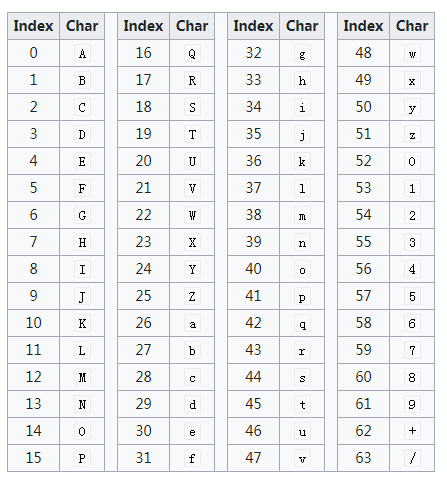

# Base64 #

## 概念 ##

Base64就是一种基于**64个可打印字符**来表示**二进制数据**的方法。

**Base64** is a group of similar **binary-to-text encoding** schemes that represent binary data in an ASCII string format by translating it into a radix-64 representation. The term Base64 originates from a specific MIME content transfer encoding.

Each base64 digit represents exactly 6 bits of data. **Three 8-bit bytes** (i.e., a total of 24 bits) can therefore be represented by **four 6-bit base64 digits**.

## Base64 table ##

The Base64 index table:

## 用途 ##

可以将图片转换成Base64编码。
采用Base64编码具有不可读性，需要解码后才能阅读。

## 参考 ##

https://en.wikipedia.org/wiki/Base64

